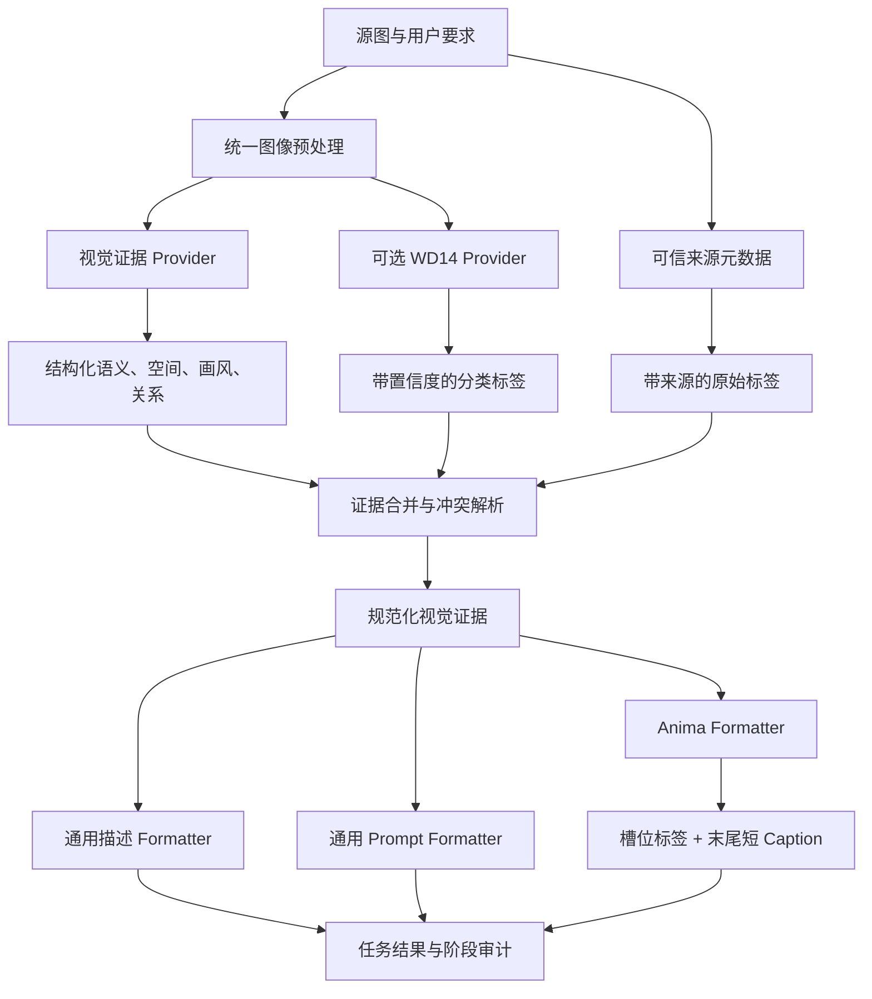

# 图片反推与 Anima 混合提示词管线设计报告

## 1. 文档目的

本文审计一份外部 ComfyUI 动漫反推工作流样本，对照当前绘图姬图片反推与 Anima 提示增强实现，并结合 ComfyUI、WD14、WD EVA02 Large v3、ONNX Runtime、Danbooru 分类、OpenAI 视觉输入与 Structured Outputs 文档，给出可在现有架构内实施的混合反推方案。该外部样本不随本仓库分发。

本文最初作为设计基线持久化；后续实施必须在本节持续登记，避免文档目标与生产能力混淆。

### 1.1 实施状态（2026-07-26）

已完成并部署 Phase 1：

- OpenAI 兼容视觉请求优先使用严格 `json_schema`，真实端点不支持时自动降级为 `json_object` 或提示词 JSON；
- 每个新版结果持久化结构化输出层级、视觉 Provider、处理阶段、分类证据和兼容告警；
- 用户端可在提交前开关“保存分析证据”，结果页可筛选证据和复制审计 JSON；
- 标签模式新增 Anima 目标格式和确定性 `anima-slot-v1` 单行无权重格式器；
- 历史任务继续通过原有 `resultJson` 恢复，新字段保持旧记录兼容；
- 已通过生产真实图片链路验证：严格 schema 生效、视觉 Provider 成功、证据和 Anima Prompt 正常返回。

已继续完成 Phase 2：

- GPU 图片服务新增真实 `POST /v1/tag`，使用 `wd-eva02-large-tagger-v3`、ONNX Runtime CUDA Provider 和长期复用 Session；
- 模型与 `selected_tags.csv` 在部署阶段从可达镜像源下载并校验，业务请求不承担 1.26GB 权重下载；
- 标签模式可由用户选择 `vision-only` 或 `hybrid`，混合模式并行调用视觉模型和 WD14；
- WD14 失败或超时时只降级本次任务，视觉结果继续完成，并在任务审计中记录原因；
- WD14 标签保留 `category/confidence/source`，只有模型原生概率显示为置信度，生成权重继续保持独立语义；
- 管理后台可配置 Provider 地址、密钥、模型、超时、阈值和标签上限，并查看模型文件、标签表、Session 与 Execution Provider 健康状态；
- 用户端只在 Provider 配置完整时开放“视觉 + WD14”，历史任务继续恢复实际管线、Provider、阶段和证据。

已继续完成 Phase 3：

- 分析结果持久化证据来源计数与高影响互斥项冲突，冲突保持可审计，不在依据不足时自动篡改最终 Prompt；
- 历史列表使用独立轻量分析摘要展示实际管线、Provider 状态、证据/告警/冲突数量和 Anima Prompt 可用性，不读取完整结果 JSON；
- 标签结果可把已保存的 Anima Prompt 一次性带入绘图页，不重新识图、不自动提交、不扣费，也不擅自改变用户已选模型。

已继续完成 Phase 4 首轮基线：

- 新增公开图库固定样本校准执行器，每张图只调用一次视觉模型和一次最低阈值 WD14，再从同一证据重放全部 24 组阈值；
- 真实完成 10 张跨 12 天公开图库样本，严格结构成功率和 formatter 稳定率均为 100%；
- 生成独立 A/B 盲评表与答案键，完整 Prompt 和图片地址只保存在生产与本机私有报告目录；
- 聚合结果持久化到 `docs/image-reverse-calibration-baseline-20260726.md`，生产阈值在实际 Anima 盲评前保持不变。

## 2. 结论摘要

1. 不整体移植该 ComfyUI 工作流。它包含 161 个节点和大量界面编排、预览、开关、下载与生成节点；整体移植会绕开 backend 已有鉴权、队列、任务恢复和历史记录职责。
2. 值得移植的是“视觉 Caption + 专用标签器 + 分类整理 + 确定性格式化”的证据合并思想，而不是节点图本身。
3. 当前 JSON 的保存状态主要走 Danbooru 原帖标签分支，WD14、本地视觉反推、在线视觉反推均处于关闭状态；它当前并不是一套面向任意本地图都重新识别的完整反推链路。
4. 当前项目的视觉模型擅长画面语义、空间关系、构图、光影和画风描述，但标签模式缺少标签置信度、类别和来源；Anima 提示增强又直接让模型生成最终标签，缺少可审计的中间证据。
5. 推荐目标是双路证据管线：视觉模型产出严格结构化视觉证据，可选 WD14 Provider 产出带置信度的 Danbooru 标签；backend 合并证据、处理冲突，再由确定性 formatter 输出通用描述或 Anima 单行提示词。
6. WD14 应作为可降级的独立 Provider。Provider 未配置、超时或健康异常时，任务继续使用 vision-only，不让反推和生图主任务被外部标签器阻断。
7. 第一阶段先完成严格结构化视觉证据和确定性 Anima formatter，不增加运行依赖；第二阶段再接入真实 WD14 服务并用项目测试集校准阈值。

## 3. 审计对象与可复核信息

| 项目 | 结果 |
|---|---|
| 文件 | 外部 ComfyUI 工作流样本，不随仓库分发 |
| Workflow JSON 版本 | `0.4` |
| 节点数 | 161 |
| 连接数 | 211 |
| 分组数 | 30 |
| 审计日期 | 2026-07-26 |

该文件属于 ComfyUI 浏览器工作流 JSON，而不是可直接提交给 `POST /prompt` 的 API Prompt。生产接入 ComfyUI 时，必须使用前端导出的 API 格式，不能把这份 0.4 工作流原样发送到服务端。

## 4. 原工作流逻辑

### 4.1 输入与分支

工作流有三类主要输入：

- Danbooru 图片或帖子信息；
- AnimaDex 相关图片或元数据；
- 用户本地上传图片。

它针对数据来源采用不同证据：

- 已知 Danbooru 来源时优先使用帖子原始标签；
- 普通本地图可进入 `wd-eva02-large-tagger-v3`；
- 可选本地 Qwen3.5-9B 或在线视觉模型生成空间 Caption。

### 4.2 标签整理

标签会按人数、角色、系列、画师、外观、服装、姿势、表情、背景、配饰等类别拆分，再进行补充、过滤和去重。WD14 的工作流阈值是：

- general：`0.35`；
- character：`0.85`。

随后 `AnimaPromptConverter` 按槽位重排标签，并把标签与可选 Caption 合并后交给 Anima 生图。

### 4.3 Caption 约束

视觉 Caption 被约束为不包含画风词、最多 60 个英文词，主要补足标签难以表达的空间位置、动作关系和多人归属。

这个思路合理，但“禁止画风词”只适合把 Caption 作为 Danbooru 标签的关系补充，不适合当前项目的详细反推描述模式。绘图姬仍需保留画风、材质、线条、上色、光影和后期分析。

### 4.4 当前保存状态

文件内保存的主要开关状态为：

| 分支 | 状态 |
|---|---|
| D站输出 | 开启 |
| Anima | 开启 |
| WD14 | 关闭 |
| 本地反推 | 关闭 |
| 在线反推 | 关闭 |

因此，这份文件当前主要体现“使用可信站点原帖标签并整理成 Anima 提示词”，不能把其当前效果直接等同于“WD14 + 视觉模型混合反推”。

## 5. 当前项目实现审计

### 5.1 图片反推

相关实现：

- `apps/backend/src/modules/tools/image-reverse-service.ts`
- `apps/backend/src/modules/tools/image-reverse-job-service.ts`
- `packages/shared-contracts/src/tools/tools-contracts.ts`

当前能力：

- 支持 `description`、`prompt`、`character`、`tags`、`edit` 五种模式；
- 输入图统一缩到最长边 2048px，并转成 JPEG 92、4:4:4；
- `gpt-5.6-sol` 使用 `reasoning_effort=medium`；
- 描述模式使用 3000 `max_tokens`，其他模式使用 4000；
- 首选 `response_format=json_object`，第三方不支持时去掉参数重试；
- 结果字段缺失时会执行必要的补充识图；
- 任务有持久化、重启恢复和历史记录；
- 队列并发为 4，等待上限为 16，单用户最多 2 个活跃任务。

主要差距：

- `tags` 模式的标签完全由通用视觉模型生成；
- 标签没有 `confidence`、`category`、`source`、`characterIndex`；
- 合并和互斥发生在最终文本附近，缺少统一证据层；
- `json_object` 只能保证合法 JSON，不能严格保证业务 schema；
- 第二次识图会增加时延，且两次结果可能产生语义漂移。

### 5.2 Anima 提示增强

相关实现：

- `apps/backend/src/modules/generations/anima-prompt-assist-service.ts`
- `apps/backend/src/modules/generations/anima-prompt-knowledge.ts`
- `apps/backend/src/modules/generations/prompt-assist-shared.ts`

当前能力：

- 最多读取 4 张参考图；
- 参考图同样优化为 2048px 内高质量 JPEG；
- 视觉模型直接输出最终的一行小写 Anima prompt；
- backend 会做去重、长度限制和有限的精确互斥清理；
- `gpt-5.6-sol` 当前使用 `reasoning_effort=low`，避免隐藏推理耗尽 90 秒预算。

主要差距：

- 视觉识别、证据合并和最终格式化由同一次自由文本生成完成，难以定位“识错”还是“格式化错”；
- 多参考图的角色归属只存在于模型上下文，没有稳定的 `characterIndex` 中间表示；
- 最终提示词没有记录每个标签的来源和置信度；
- 相同输入很难得到完全稳定的槽位顺序和互斥处理结果。

## 6. 外部资料核验

本节链接均于 2026-07-26 通过当前代理重新访问，关键页面返回 HTTP 200。

### 6.1 ComfyUI

- [Workflow JSON 0.4 规范](https://docs.comfy.org/specs/workflow_json_0.4)
- [当前 Workflow JSON 规范](https://docs.comfy.org/specs/workflow_json)
- [Workflow 核心概念](https://docs.comfy.org/development/core-concepts/workflow)
- [ComfyUI server.py](https://github.com/Comfy-Org/ComfyUI/blob/master/server.py)

确认事项：

- 浏览器工作流与 API Prompt 是两个不同用途的结构；
- ComfyUI 服务端真实使用 `POST /upload/image`、`POST /prompt`、`GET /history/{prompt_id}` 和 `GET /queue` 等路由；
- 若复用 ComfyUI 标签节点，必须先确认远端安装了对应自定义节点和模型，再使用实际 API Prompt，不得假定节点存在。

### 6.2 WD14 与 WD EVA02 Large v3

- [ComfyUI-WD14-Tagger](https://github.com/pythongosssss/ComfyUI-WD14-Tagger)
- [wd-eva02-large-tagger-v3 模型卡](https://huggingface.co/SmilingWolf/wd-eva02-large-tagger-v3)
- [ONNX Runtime Execution Providers](https://onnxruntime.ai/docs/execution-providers/)

确认事项：

- 插件按模型输入边长等比缩放，以白色补成正方形，并执行 RGB 到 BGR 的输入转换；
- 插件使用 `model.onnx` 和 `selected_tags.csv`，类别 `0` 是 general，类别 `4` 是 character；
- 插件默认阈值与工作流一致，为 general `0.35`、character `0.85`；
- 模型卡给出的验证集 `P=R` 阈值约为 `0.5296`，说明默认 `0.35` 不是所有业务目标下的最优固定值；
- 模型支持动态 batch，ONNX Runtime 应长驻复用 `InferenceSession`；
- GPU Provider 应优先，CPU Provider 作为后备，不能每次请求重新装载模型。

### 6.3 Danbooru 分类

Danbooru 源码中的标签类别为：

- general：`0`；
- artist：`1`；
- copyright：`3`；
- character：`4`；
- meta：`5`。

可信 Danbooru 原帖元数据可以作为标签证据，但仅限图片已知来自对应帖子并能验证元数据。普通上传图不应默认执行反向搜图，也不应把视觉模型猜测的画师名伪装成可信 artist 标签。

### 6.4 OpenAI 视觉与结构化输出

- [Images and vision](https://developers.openai.com/api/docs/guides/images-vision)
- [Structured Outputs](https://developers.openai.com/api/docs/guides/structured-outputs)

确认事项：

- 视觉接口支持多图输入，但图片会占用 token，数量和分辨率会直接影响时延与成本；
- 视觉模型对计数、精确空间关系和 Caption 存在固有限制，因此需要结构化证据、置信度和冲突检查；
- `json_schema` 配合 `strict=true` 才能约束字段、类型和枚举；`json_object` 只保证输出是 JSON 对象；
- 对兼容端点应先探测严格 schema 能力，不支持时再降级到 `json_object` 和当前字段校验。

### 6.5 Anima 社区提示词资料

- [diealone0327/anima-prompt](https://github.com/diealone0327/anima-prompt)

值得采用：

- 单行、小写、使用 `, ` 分隔；
- 不使用权重语法；
- 槽位顺序为人数、身份、外观、服装、动作、表情、镜头、场景、细节、自然语言；
- 多人归属、复杂空间关系放在末尾短 Caption；
- 输出前检查人数、重复、互斥和物理兼容性。

不应照搬：

- 为凑标签数量而添加不可见内容；
- 默认补充直视镜头等构图；
- 固定删除所有光线或画风信息；
- 把社区经验当成模型官方接口规范。

## 7. 目标架构

### 7.1 职责边界

| 组件 | 职责 | 明确不负责 |
|---|---|---|
| backend 反推任务服务 | 鉴权、上传校验、任务创建、队列、恢复、历史记录、结果落库 | 加载大型 ONNX 模型 |
| 视觉证据 Provider | 识别主体、空间、动作、构图、画风、光影、材质和复杂关系 | 直接决定最终 Anima 文本 |
| WD14 Provider | 输出分类标签、置信度和模型版本 | 推断复杂空间关系 |
| 来源元数据 Provider | 读取已验证来源的原始标签 | 对普通图片执行隐式搜图 |
| 证据合并器 | 来源优先级、角色归属、冲突处理、警告 | 自由发挥添加新内容 |
| Formatter | 确定性排序、去重、互斥和目标格式输出 | 再次识图或改变用户语义 |

### 7.2 Provider 部署选择

推荐顺序：

1. 独立 WD14 推理服务：长期最清晰。服务长驻 ONNX Session，使用 CUDA 后备 CPU，提供真实健康检查、模型版本和批处理。
2. 复用已验证的 ComfyUI：仅在服务器已安装 WD14 插件、模型和固定 API Prompt 后使用。需通过真实 `/object_info`、上传、`/prompt`、历史结果验证，不能仅凭网页能打开判断可用。
3. backend 进程内 ONNX：不推荐。会增加 backend 内存、GPU/CPU 依赖和故障面，违背当前服务职责拆分。

## 8. 结构化证据设计

以下是共享契约的设计形态，不是本轮代码变更。实施前需先登记到 `standards/interfaces/README.md`，再落到 `packages/shared-contracts`。

### 8.1 标签证据

每个标签至少保留：

| 字段 | 含义 |
|---|---|
| `name` | 规范化英文标签 |
| `category` | `general/character/artist/copyright/meta/derived` |
| `confidence` | `0..1`；可信元数据可使用单独的确定性标记，不能伪造模型分数 |
| `source` | `user/metadata/wd14/vision/derived` |
| `characterIndex` | 标签所属角色；全局标签为空 |
| `visible` | 是否在画面可见 |
| `evidence` | 可选的简短依据或来源字段名 |

标签在 formatter 前不能过早压平成逗号字符串，否则会丢失置信度、分类和角色归属。

### 8.2 视觉证据

视觉模型一次输出以下结构：

- 主体数量与每个主体的稳定索引；
- 每个主体的身份、外观、服装、配饰、动作、表情；
- 主体间关系和空间归属；
- 镜头、画幅、视角、景别、裁切和构图；
- 场景、前中后景、光源方向、色彩和气氛；
- 线条、上色、材质、锐度、景深和后期等画风证据；
- 不确定项和冲突警告；
- 最多 60 英文词的关系 Caption，仅在 Anima 标签无法表达时生成。

字段应使用严格 JSON Schema；对不支持的第三方端点保留兼容降级，但降级结果必须继续经过本地 schema 校验。

### 8.3 来源优先级

冲突时使用以下顺序：

1. 用户明确文字要求；
2. 已验证来源的原始元数据；
3. WD14 高置信度标签；
4. 视觉模型明确可见的结构化判断；
5. 确定性派生标签。

画师、角色名和作品名的特殊规则：

- 用户明确指定或可信元数据存在时可保留；
- WD14 character 标签达到配置阈值时可作为候选并标注来源；
- 视觉模型不得猜测画师并作为事实输出；
- 低置信度专有名词不进入最终提示词，只进入警告或候选列表。

## 9. 各模式的管线策略

| 模式 | 默认 Provider | 输出策略 |
|---|---|---|
| `description` | vision-only | 保留详细画风、光影、材质、空间和后期，不受 Anima 标签规则限制 |
| `prompt` | vision-only，可读已存在标签证据 | 输出目标模型适用的自然语言提示词 |
| `character` | vision-only | 只提取角色稳定身份和外观，不混入姿势、背景、镜头与画风 |
| `edit` | vision-only | 围绕编辑意图区分保留项和变更项 |
| `tags` | hybrid，失败时 vision-only | 输出分类标签，并保留来源、分数与警告 |
| Anima 提示增强 | hybrid，失败时 vision-only | 使用槽位标签，复杂关系放末尾短 Caption |

WD14 不应强制加入所有模式。它对 Danbooru 词汇标签有价值，但不能替代描述模式所需的画面理解。

## 10. Anima 确定性格式器

### 10.1 输出协议

- 单行；
- 全部小写；
- 使用英文逗号和单个空格分隔；
- 不使用 `(tag:1.2)` 等权重；
- 按固定槽位顺序；
- 同义词归一后去重；
- 只输出可见或用户明确要求的内容；
- 复杂多人归属和空间关系作为末尾短英文 Caption；
- 不输出“图一”“参考图”“原图”等离开请求上下文后失效的措辞。

### 10.2 槽位顺序

1. 人数；
2. 身份与角色归属；
3. 外观；
4. 服装与配饰；
5. 动作与姿势；
6. 表情和视线；
7. 镜头与构图；
8. 场景和背景；
9. 光影、材质和细节；
10. 复杂关系 Caption。

### 10.3 冲突处理

- 互斥标签采用类别内决策，不靠全字符串替换；
- 用户明确文字始终覆盖图片推断；
- 多角色标签必须绑定 `characterIndex`，不能因参考图数量直接复制角色；
- 相同角色多视角应先合并身份证据，再格式化一次；
- 无法可靠判断时删除低置信度冲突项并记录 warning，不擅自补全；
- 人数、肢体状态、视角、眼睛开闭、站立/坐/躺等高影响冲突必须在输出前自检。

## 11. 任务阶段与持久化

### 11.1 阶段

建议在现有反推任务中记录：

1. `preprocess`：读取、格式转换、尺寸和哈希；
2. `vision_evidence`：视觉模型请求与结构化结果；
3. `tag_evidence`：WD14/元数据结果；
4. `merge`：来源优先级、冲突和警告；
5. `format`：目标格式和最终文本；
6. `persist`：结果落库和任务完成。

### 11.2 必须持久化的信息

- 输入图哈希、数量、原始格式和优化后尺寸；
- Provider 名称、模型版本、阈值、耗时和状态；
- 原始结构化证据和规范化证据；
- 被丢弃标签及原因；
- 冲突警告；
- 最终提示词；
- formatter 版本；
- 是否发生 provider 降级。

这些信息用于重放和回归，但 API Key、图片 data URL 和完整私有上游响应不得写入普通任务详情。

### 11.3 幂等与复用

- 主任务创建后异步执行，页面刷新只查询后端状态；
- 同一主任务的证据阶段只执行一次，格式器可基于已存证据重跑；
- 重试 formatter 不重新调用视觉模型或 WD14；
- 以 `图片哈希 + Provider 模型版本 + 阈值配置版本` 作为短期证据缓存键；
- Provider 模型升级或阈值变更后不得错误命中旧证据。

## 12. 失败与降级策略

| 故障 | 行为 |
|---|---|
| WD14 未配置 | 标记 `vision-only`，继续完成任务 |
| WD14 超时或 5xx | 记录 provider 错误与降级，继续 vision-only |
| 视觉模型严格 schema 不支持 | 去掉 strict schema，使用 `json_object` 并本地校验 |
| 视觉结果字段缺失 | 对缺失字段做一次受控修复；不重新自由识图整张图 |
| 视觉模型完全失败 | 任务失败；WD14 标签不能伪装成完整描述 |
| 元数据来源不可信 | 忽略元数据，不影响其他 Provider |
| 标签冲突 | 按来源优先级解决；无法解决则删除低优先级项并记录警告 |
| Formatter 失败 | 使用已存规范化证据重试，不重复调用识图 Provider |

## 13. 配置设计

后台建议增加一组反推 Provider 配置：

- 模式：`off`、`vision-only`、`hybrid`；
- WD14 Provider 地址和私密令牌；
- 模型标识与版本；
- general 阈值；
- character 阈值；
- Provider 超时；
- 是否启用 CUDA 批处理；
- 单批最大图片数；
- 证据缓存 TTL；
- 严格 schema 能力开关或探测结果。

默认值建议：

- 未部署真实 WD14 前保持 `vision-only`；
- 部署后先对管理员测试任务启用 `hybrid`；
- 阈值不直接固化为社区默认值，先通过测试集确定；
- Provider 地址、令牌和模型路径只放私有配置，不写入前端和普通任务 JSON。

## 14. 分阶段实施

### Phase 1：结构化视觉证据

目标：不增加外部依赖，先解决当前链路不可审计和格式不稳定。

1. 在接口登记中声明视觉证据、标签证据、警告和 Provider 状态；
2. 在 shared-contracts 落地 DTO；
3. 视觉请求改用严格 JSON Schema，保留兼容降级；
4. 拆分识图、证据规范化、冲突解析和 formatter；
5. Anima 改用确定性槽位 formatter；
6. 将阶段、证据、formatter 版本和降级信息持久化；
7. 保持现有任务创建、鉴权、并发和恢复逻辑不变。

### Phase 2：WD14 Provider

目标：为标签和 Anima 链路增加专用 Danbooru 标签证据。

1. 部署真实 `wd-eva02-large-tagger-v3` 推理服务或验证可复用 ComfyUI；
2. 完成健康、版本、批处理和超时接口；
3. backend 增加 `off/vision-only/hybrid` 配置；
4. 接入 general/character 分类和置信度；
5. Provider 异常时自动降级；
6. 用项目测试集校准阈值后再逐步开放。

### Phase 3：结果可视化

目标：让管理员和用户区分模型识别、标签推断和最终格式化。

1. 反推历史展示 Provider、耗时和降级状态；
2. 标签结果展示类别、来源和置信度；
3. 显示冲突警告与被删除标签；
4. 提供“一键带入 Anima”，使用已存证据格式化，不重新识图。

### Phase 4：质量校准

目标：用真实生成效果验证，不只比较标签文本。

1. 建立跨日期、跨画风、跨来源、单人和多人的固定测试集；
2. A/B 比较 vision-only 与 hybrid；
3. 扫描阈值；
4. 对最终 Anima 生成结果做盲评；
5. 固化阈值、formatter 版本和回归基线。

## 15. 测试与验收

### 15.1 阈值扫描

- general：`0.30 / 0.35 / 0.40 / 0.45 / 0.50 / 0.53`；
- character：`0.75 / 0.80 / 0.85 / 0.90`。

最终阈值以项目数据为准，不以单一插件默认值或模型卡指标直接决定。

### 15.2 数据集分层

- 跨日期公开图库样本，避免连续任务内容相似；
- 摄影、日系插画、厚涂、赛璐璐、3D、低清晰度和复杂背景；
- 单人、双人、多人、同角色多视角和不同角色多参考图；
- 角色特写、全身、俯视、仰视、遮挡、镜面和极端裁切；
- 有可信来源元数据与普通上传图分别统计。

### 15.3 指标

- 人数准确率；
- general/character 标签 precision、recall、F1；
- 角色串位率；
- 互斥冲突率；
- Prompt 可见内容覆盖率；
- 幻觉标签率；
- p50/p95 总时延；
- Provider 超时率和降级率；
- 同输入 formatter 稳定性；
- Anima 生成的构图、角色、动作、背景和画风复现评分。

### 15.4 最低验收条件

- WD14 故障不影响 vision-only 任务完成；
- 同一证据输入的 Anima formatter 输出完全稳定；
- 所有最终标签可追溯到用户要求、元数据、WD14、视觉证据或确定性派生；
- 不因凑标签数添加画面中不存在的内容；
- 多角色标签不会跨 `characterIndex` 串位；
- 描述模式保留当前详细画风与光影能力；
- 任务刷新、进程重启后阶段和结果不丢失；
- 私密图片内容和 Provider 凭证不出现在普通日志与公开任务详情。

## 16. 明确不移植的内容

- 不把 161 节点浏览器工作流直接放入生产 API；
- 不把 Danbooru 下载、图片浏览和生图预览节点并入 backend；
- 不默认对普通上传图片执行反向搜图；
- 不由视觉模型猜测画师标签；
- 不把 WD14 ONNX Session 塞进 backend 主进程；
- 不使用固定最低标签数量；
- 不使用社区模板的默认构图补词；
- 不让 WD14 替代详细画风和空间理解；
- 不在每次 formatter 重试时重复调用识图模型；
- 不把未验证的 ComfyUI 自定义节点当成已存在接口。

## 17. 推荐实施顺序

最小风险且收益最高的顺序是：

1. 先实施 Phase 1，把当前视觉结果变成结构化、可审计的证据，并落地确定性 Anima formatter；
2. 使用现有历史失败任务做 vision-only 回归，确认角色归属、画风和格式稳定；
3. 单独部署和压测 WD14 Provider；
4. 小流量启用 hybrid，完成阈值 A/B；
5. 最后增加前台/后台的证据与置信度展示。

该顺序不改变现有任务职责，不依赖未经验证的节点，且每一阶段都能独立回滚到当前 vision-only 行为。
