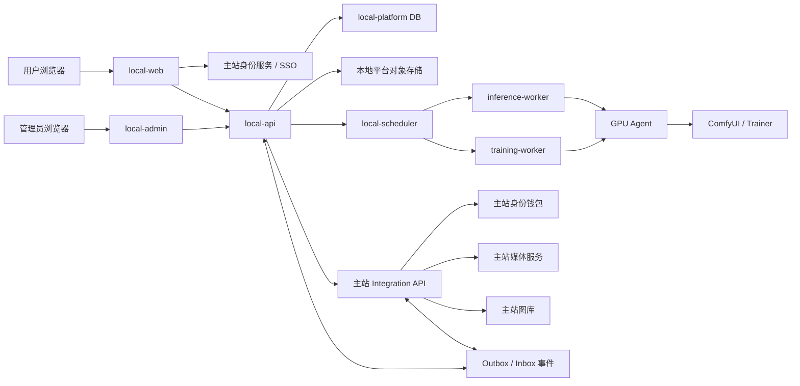
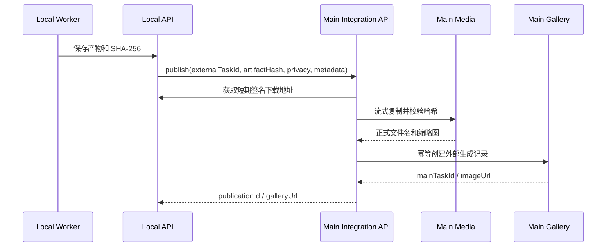

# 本地模型独立平台设计

## 1. 文档状态

- 日期：2026-07-26
- 状态：架构设计第一版，尚未切换生产流量
- 新项目建议名：`drawhime-local-platform`
- 建议本地仓库：`<repository>/local-platform`
- 建议生产根目录：`/local-platform`
- 设计目标：把本地模型推理、模型资产、LoRA 仓库和后续 LoRA 训练完整迁出主站；主站继续作为账号、身份钱包、最终媒体和图库的权威系统。

## 2. 核心结论

新项目不是主站的另一个 Worker，而是有独立前端、管理端、API、数据库、调度器、GPU Agent、对象存储命名空间和发布流程的独立产品。

必须坚持以下边界：

1. **账号不复制密码**：新项目使用主站 SSO，只保存主站用户 ID 和必要展示快照。
2. **余额不复制数字**：余额始终由主站身份钱包维护，新项目只保存幂等计费预留引用和结算结果。
3. **数据库不共享**：两个项目各自使用独立数据库，通过版本化接口和事件同步。
4. **图库由主站权威保存**：新项目拥有本地任务和临时产物，最终公开/私密图库记录及正式媒体由主站接收后创建。
5. **GPU 不直接暴露公网**：ComfyUI、训练器和模型目录只允许 GPU Agent 访问，用户和主站均不直接请求 ComfyUI。
6. **迁移先复制后切换**：LoRA、模型和历史元数据先校验复制；旧数据在完成验收和保留期前不删除。
7. **主站最终不保留本地推理能力**：切换完成后移除 `comfyui_generation`、GPU 文件同步、主站 LoRA 生成控件及本地模型运行表写入链路。

## 3. 当前边界审计

当前主站内与本地模型有关的实现分成两套：

### 3.1 当前实际生产链路

- `drawing-worker` 直接调用公网 ComfyUI `/prompt`、`/history` 和 `/view`。
- Anima 工作流、Turbo LoRA、美学 LoRA、用户 LoRA 节点由主站 Worker 组装。
- 主站 backend 保存 LoRA 仓库条目、示例图、模型文件和 SHA-256。
- 主站生成页选择 LoRA，任务快照保存 LoRA ID、强度和文件哈希。
- GPU 自定义节点负责把主站 LoRA 文件同步到 ComfyUI 模型目录。
- 本地模型仍混在主站统一模型设置、计费、任务、Worker 和图库链路中。

### 3.2 尚未上线的本地模型平台骨架

`apps/local-model-platform` 已包含 backend、web、admin、worker 和 shared，但当前只支持本地配置、目录扫描和模型注册概览，不接管真实推理、训练、账号、钱包或图库。

主站 Prisma 还保留：

- `LocalInferenceHost`
- `LocalModelProvider`
- `LocalModel`
- `LocalModelFile`
- `LocalNodeCatalog`
- `LocalWorkflowTemplate` / `LocalWorkflowTemplateVersion`
- `LocalRun` / `LocalRunNode` / `LocalRunArtifact`
- `WorkflowLocalTask` / `WorkflowLocalTaskArtifact`
- `WorkflowLocalTaskChargeAllocation`
- `LoraRepositoryItem` / `LoraBaseModel` / `LoraExampleImage`

这些资产应作为新项目的迁移输入，而不是继续在主站内扩建。

## 4. 项目职责

### 4.1 新项目负责

- 本地模型用户前端和管理后台。
- 本地文生图、图生图、控制图和后续视频/音频等本地推理任务。
- ComfyUI/原生推理 Runtime 适配、工作流版本和节点白名单。
- GPU 主机、显存、队列、并发、健康、取消和重试。
- 基础模型、VAE、文本编码器、ControlNet、LoRA 等模型资产注册与分发。
- LoRA 仓库、版本、触发词、示例图和兼容性。
- 训练数据集、LoRA 训练、评估、版本发布和产物治理。
- 本地任务历史、日志、阶段时间线和运行参数。
- 临时产物及训练产物的对象存储。
- 调用主站完成 SSO、余额预留/结算以及最终图库发布。

### 4.2 主站继续负责

- 用户注册、登录、邮箱验证、密码、角色和封禁状态。
- QQ 绑定和身份钱包。
- 余额、充值、流水、计费预留、结算和退款。
- 主站远程 API 绘图、Bot 和工作台。
- 正式媒体存储、缩略图、公开图库、私密图库、点赞、浏览和标签。
- 主站历史本地模型任务和图片的只读兼容展示。
- 新项目入口导航和 SSO 授权入口。

### 4.3 明确禁止

- 新项目直接连接主站数据库。
- 新项目保存主站密码哈希、JWT 密钥或真实余额副本。
- 主站直接连接新项目数据库。
- 浏览器直接访问 GPU、ComfyUI、训练器或对象存储管理凭证。
- 新项目根据本地缓存余额自行判断最终扣费成功。
- 两个项目对同一任务状态或同一正式图库记录同时拥有写入权。

## 5. 总体架构



## 6. 服务拆分与端点

新项目使用自己的端口命名空间，不占用主站 `6369/3004/3005/3011-3016`。

| 程序 | 建议端口 | 公网入口 | 职责 |
|---|---:|---|---|
| `local-web` | 7100 | `https://www.xanime.ink/local-model/` | 用户生成、任务、模型、LoRA、数据集和训练页面 |
| `local-admin` | 7101 | `https://admin.xanime.ink/local-model-admin/` | GPU、模型、队列、价格、训练和审计管理 |
| `local-api` | 7102 | 两个域名的 `/local-model-api/` | 用户 API、SSO 回调、任务、资产和发布编排 |
| `local-scheduler` | 7103 | 仅内网 | 任务排队、资源匹配、租约、超时和恢复 |
| `local-gpu-gateway` | 7104 | 仅内网 | GPU Agent 注册、心跳、任务领取和回写 |
| `local-training` | 7105 | 仅内网 | 数据准备、训练计划、指标和版本发布 |
| `local-artifact` | 7106 | 仅内网 | 临时产物、训练产物和分片上传控制面 |
| `gpu-agent` | 7110 | VPN/内网 | 单台 GPU 主机代理；ComfyUI 与训练器不暴露 |

部署初期可把 `local-api/local-scheduler/local-training/local-artifact` 放在同一 monorepo 和同一主机，但进程、端口、队列消费者和数据库职责必须独立，避免再次形成单体耦合。

## 7. 推荐仓库结构

```text
drawhime-local-platform/
  apps/
    web/
    admin/
    api/
    scheduler/
    inference-worker/
    training-worker/
    gpu-agent/
    artifact-service/
  packages/
    contracts/
    auth-client/
    billing-client/
    gallery-client/
    model-registry/
    workflow-runtime/
    storage-client/
    observability/
  prisma/
  deploy/
  docs/
  scripts/
  tests/
```

现有 `apps/local-model-platform` 只作为提取种子。新仓库建立后，主站不再双向修改该目录；迁移期修复应先落新仓库，再按需要做一次性兼容同步。

## 8. 账号同步设计

### 8.1 推荐方案：主站作为第一方身份提供方

使用 Authorization Code + PKCE：

1. 用户打开 `local.xanime.ink`。
2. 未登录时跳转主站 `/oauth/authorize`。
3. 主站完成登录和授权，返回一次性 code。
4. `local-api` 通过服务端 `/oauth/token` 换取短期 access token 和 refresh token。
5. `local-api` 使用 `/oauth/userinfo` 获取 `sub/username/avatar/role/accountStatus`。
6. 新项目按 `issuer + sub` 幂等创建 `external_identity`，不保存密码。

Token 至少包含：

```json
{
  "iss": "https://www.xanime.ink",
  "aud": "drawhime-local-platform",
  "sub": "MAIN_USER_ID",
  "sid": "SESSION_ID",
  "role": "user",
  "exp": 0
}
```

### 8.2 账号事件

主站通过 outbox 发送：

- `identity.profile.updated`
- `identity.account.disabled`
- `identity.account.deleted`
- `identity.role.changed`
- `identity.session.revoked`

新项目通过 inbox 按 `eventId` 幂等消费。账号禁用或删除必须立即阻止新任务；历史任务和计费记录按审计保留策略保存，不做物理级联删除。

### 8.3 不采用的方案

- 不共享主站 JWT 密钥。
- 不把主站 `users` 表定时复制成第二份登录库。
- 不让新项目自行处理邮箱验证和密码重置。
- 不通过 URL 传长期 JWT。

## 9. 余额与计费同步设计

### 9.1 权威边界

余额仍属于主站身份钱包。新项目本地表只保存：

- `externalTaskId`
- `reservationId`
- `productCode`
- `pricingVersion`
- `reservedAmount`
- `committedAmount`
- `billingStatus`

这些字段是计费审计镜像，不可作为余额。

### 9.2 价格目录

本地模型的价格配置由新项目管理，但扣费时主站不能直接相信请求金额。采用版本化价格目录：

1. 新项目发布 `productCode + pricingVersion + unitPrice + billingUnit`。
2. 主站 Integration API 保存只读价格镜像。
3. 管理员确认或自动验签后使版本生效。
4. 任务预留只提交产品、版本和数量，主站按镜像计算金额。

计费单位支持：

- 单张固定价
- 像素阶梯
- 视频秒数
- GPU 秒
- 训练最大预算

### 9.3 预留、提交和释放

建议新增主站接口：

```text
POST /internal/integrations/local-model/billing/reservations
POST /internal/integrations/local-model/billing/reservations/:id/commit
POST /internal/integrations/local-model/billing/reservations/:id/release
GET  /internal/integrations/local-model/billing/reservations/:id
```

预留请求：

```json
{
  "externalTaskId": "LOCAL_TASK_ID",
  "userId": 1,
  "productCode": "anima-image-v1",
  "pricingVersion": 3,
  "quantity": 1,
  "source": "local-web"
}
```

规则：

- `externalTaskId` 在该 integration client 下唯一。
- 主站事务内解析用户可访问钱包、扣除可用余额并保存原始钱包分账。
- `commit` 只允许一次，把预留转成正式 charge 流水。
- `release` 只允许一次，按预留分账原路释放。
- 重复请求返回同一结果，不重复扣款或退款。
- 本地任务创建必须先持久化，再预留，再进入调度队列。
- 主站不可达时任务停留 `billing_pending`，不进入 GPU。

### 9.4 训练计费

训练属于不确定成本任务：

1. 根据数据量、步数、分辨率和 GPU 类型计算最大预算。
2. 主站预留最大预算。
3. 训练器按 GPU 秒和实际步骤计量。
4. 成功、失败或取消后提交实际金额并释放剩余预留。
5. 超出预算前训练器必须安全暂停，不允许先欠费后补扣。

## 10. 图库与媒体同步设计

### 10.1 权威边界

- 新项目对象存储：任务输入、训练数据、运行中间产物、未发布结果、模型和 LoRA。
- 主站媒体服务：用户选择入图库后的正式原图、缩略图和公开访问地址。
- 主站图库数据库：正式图片/视频记录、隐私、标签、点赞、浏览和 SEO。

### 10.2 发布流程



建议新增主站接口：

```text
POST /internal/integrations/local-model/generations/:externalTaskId/publish
GET  /internal/integrations/local-model/generations/:externalTaskId
POST /internal/integrations/local-model/generations/:externalTaskId/unpublish
```

发布必须满足：

- Integration client、用户 ID、外部任务 ID 和产物哈希一致。
- 主站先完成媒体落盘，再创建图库记录。
- `externalTaskId + artifactHash` 唯一，重复回调返回原记录。
- 私密状态在创建事务中确定，不允许先公开后修正。
- 主站只保存实际提交给本地模型的最终提示词和可审计参数。
- 新项目失败不得创建空图库记录。

### 10.3 历史和删除

- 现有主站本地模型历史图片继续保留原 URL 和任务 ID。
- 新项目任务详情保存 `mainTaskId/galleryUrl`，但不复制点赞和浏览数据。
- 用户删除主站图库记录后，主站发送 `gallery.publication.deleted`；新项目只标记发布关系失效。
- 训练数据和临时产物是否删除由新项目保留策略决定，不能因图库删除误删仍被模型版本引用的训练资产。

## 11. 新项目数据模型

### 11.1 身份与集成

- `ExternalIdentity`：`issuer/sub`、展示快照、账号状态。
- `ServiceClient`：主站和 GPU Agent 的服务身份，不保存明文密钥。
- `InboxEvent` / `OutboxEvent`：跨项目事件幂等与重放。
- `IdempotencyKey`：用户提交和内部接口幂等响应。

### 11.2 推理任务

- `InferenceJob`：用户请求、最终提示词、隐私、模型版本、状态和主站发布引用。
- `InferenceAttempt`：调度、GPU、Runtime、参数、错误和耗时。
- `JobStage`：计费、排队、模型同步、执行、保存、发布等时间线。
- `JobArtifact`：输入、预览、输出、中间文件和 SHA-256。
- `BillingReservationMirror`：主站 reservation 引用和本地状态。
- `GalleryPublicationMirror`：主站 task/image 引用和同步状态。

### 11.3 模型和工作流

- `ModelFamily`：Anima、Krea2 等系列。
- `ModelVersion`：精确 checkpoint、架构、精度、默认参数和兼容矩阵。
- `ModelFile`：类型、大小、SHA-256、对象存储 key 和分发状态。
- `RuntimeDefinition`：ComfyUI、Diffusers 或其他执行器版本。
- `WorkflowTemplate` / `WorkflowVersion`：不可变工作流 JSON、节点白名单和输入 schema。
- `GpuHost` / `GpuDevice`：主机、显卡、显存、标签、状态和并发。
- `GpuLease`：任务对 GPU 的有期限租约，避免 Worker 崩溃后永久占用。

### 11.4 LoRA 仓库与训练

- `LoraEntry`：标题、类型、作者、主模型系列和发布状态。
- `LoraVersion`：精确基础模型版本、触发词、权重建议、训练参数和模型哈希。
- `LoraExample`：多张示例图、提示词、种子和生成参数。
- `TrainingDataset`：私有数据集、许可声明、去重摘要和统计。
- `DatasetAsset`：原文件、标准化文件、caption、标签和 SHA-256。
- `TrainingJob` / `TrainingAttempt`：训练状态、计划、资源、指标和计费。
- `EvaluationRun`：固定种子样例、对比结果和质量评分。
- `ModelDistribution`：各 GPU 节点的模型分发、校验和可用状态。

## 12. GPU 与执行协议

### 12.1 GPU Agent

每台 GPU 主机只运行受控 Agent。Agent 负责：

- 注册 GPU、显存、驱动、Runtime 和模型目录摘要。
- 领取带租约的任务，不接受浏览器请求。
- 按 SHA-256 同步模型、LoRA 和工作流。
- 使用本地随机临时目录准备输入。
- 把新项目 `jobId/attemptId` 映射为 Runtime 原生 ID。
- 上报阶段、进度、日志摘要、指标和产物。
- 收到取消命令时中断 Runtime 并清理排队项。
- 重启后扫描未完成任务并与 scheduler 对账。

### 12.2 ComfyUI 规则

- ComfyUI 只监听回环或 VPN 地址。
- `/prompt` 不暴露到公网。
- `prompt_id` 使用 `attemptId` 的确定性 UUID，重试不得生成第二个排队任务。
- 提交成功后只重试状态查询，不重复提交 `/prompt`。
- scheduler 保存 Runtime 原生 ID，任务终态或租约过期时调用取消接口。
- 单 GPU 默认并发按显存和工作流配置；P40 Anima 初始值为 `1`。
- 队列长度、预计等待时间和显存不足必须在用户提交前可见。

### 12.3 模型分发

- 模型文件以 SHA-256 为身份，不以用户文件名为身份。
- Agent 先查本地清单，缺失时使用短期签名 URL 分片下载。
- 下载完成后校验大小、SHA-256 和 safetensors 结构，再原子进入模型目录。
- 已被运行租约引用的模型版本禁止删除。
- 模型清理采用引用计数、最后使用时间和磁盘水位策略，不由用户删除请求直接触发。

## 13. LoRA 训练扩展

### 13.1 用户流程

1. 创建训练草稿并选择精确基础模型版本。
2. 上传多张训练图和可选 caption。
3. 服务端进行格式统一、哈希去重、尺寸统计和数据检查。
4. 用户设置 LoRA 类型、标题、描述、触发词和训练目标。
5. 系统生成训练计划、预计时间和最大预算。
6. 主站完成训练预算预留。
7. scheduler 分配训练 GPU，执行数据准备、训练和固定样例评估。
8. 用户比较版本和样例后发布 LoRA 版本。
9. 发布版本进入模型分发，并可直接用于新项目生成。

### 13.2 状态机

```text
draft
  -> validating
  -> ready
  -> billing_pending
  -> queued
  -> staging
  -> training
  -> evaluating
  -> publishing
  -> success | failed | canceled
```

### 13.3 版本与兼容性

- LoRA 必须绑定精确 `baseModelVersionId`，不能只保存 `anima`。
- 同系列其他 checkpoint 的兼容状态必须显式为 `verified/compatible/unknown/incompatible`。
- 触发词、建议强度和训练标签应从 safetensors metadata 提取并允许作者校正。
- 每次重新训练创建新版本，不覆盖旧文件。
- 示例图必须保存生成它的 LoRA 版本、工作流版本、种子、提示词和强度。

## 14. 跨项目接口规范

所有跨项目请求使用独立 integration client 身份，推荐 mTLS 加短期 JWT；过渡期可使用轮换 HMAC，但不得复用主站 `WS_PROXY_TOKEN`。

统一规则：

- 成功：`{ "ok": true, "data": ... }`
- 失败：`{ "ok": false, "code", "message" }`
- 写请求必须带 `Idempotency-Key`。
- Webhook 必须带 `eventId/eventType/occurredAt/schemaVersion` 和签名。
- 请求、响应和事件都带 `traceId`。
- 接口按 `/v1` 版本化；破坏性字段进入 `/v2`，不原地改语义。
- 两端都持久化 inbox/outbox，HTTP 成功不等于业务事件已完成。
- 对账任务每天比较预留、结算、发布和任务终态，差异进入人工审计队列。

## 15. 失败处理矩阵

| 场景 | 新项目行为 | 主站行为 |
|---|---|---|
| SSO 暂时不可用 | 已有短会话可读历史，禁止创建新计费任务 | 保持身份权威 |
| 余额预留失败 | 任务停在 `billing_failed`，不进 GPU | 不产生扣费 |
| 预留成功、入队失败 | 重试入队；超过窗口后释放预留 | 幂等释放 |
| GPU 崩溃 | 租约过期后重新调度或失败 | 预留保持到最终决定 |
| 生成成功、主站发布失败 | 产物保留并重试发布 | 不创建半成品图库记录 |
| 主站发布成功、响应丢失 | 按外部任务 ID查询并恢复 | 返回原 publication |
| 任务失败或取消 | 提交实际可计费部分或释放全部 | 按原钱包分账处理 |
| 事件重复 | inbox 幂等忽略 | inbox 幂等忽略 |

## 16. 迁移路线

### 阶段 0：冻结边界

- 主站不再新增新的本地模型专用表和页面。
- 记录当前 LoRA、模型文件、GPU、任务和媒体基线。
- 备份相关数据库表和 `/v3/local/lora-repository`。
- 为主站历史任务标记本地模型来源和不可变模型名。

### 阶段 1：建立独立仓库和基础设施

- 从 `apps/local-model-platform` 提取可复用代码到新仓库。
- 建立独立数据库、Redis、对象存储命名空间和 CI/CD。
- 部署 `local-web/local-admin/local-api/scheduler/gpu-agent` 健康骨架。
- GPU 端口收回内网，Agent 成为唯一入口。

### 阶段 2：接入 SSO

- 主站实现第一方 OAuth/OIDC 最小接口。
- 新项目完成 PKCE 登录、用户映射、登出和封禁事件。
- 仅开放模型和历史只读页，不开放计费任务。

### 阶段 3：接入余额预留

- 主站新增 integration client、价格镜像和 reservation 表。
- 新项目实现预留、提交、释放和每日对账。
- 使用合成钱包和真实事务测试重复请求、超时、取消和退款。

### 阶段 4：接入正式媒体和图库发布

- 新项目产物先落独立对象存储。
- 主站实现按哈希复制、图库幂等创建和隐私同步。
- 验证成功、重复回调、响应丢失和删除事件。

### 阶段 5：迁移模型和 LoRA

- 导出 LoRA 元数据、示例图、文件大小和 SHA-256。
- 复制文件到新项目对象存储，逐文件校验哈希。
- 建立旧 ID 到新 UUID 的映射表。
- 从 safetensors metadata 提取基础模型、触发词和训练摘要。
- 主站 LoRA 仓库进入短期只读，写入全部切到新项目。
- 校验数量、字节数、哈希和示例图后再开放新仓库。

### 阶段 6：切换本地生成

- `local.xanime.ink` 开放真实任务。
- 主站导航中的本地模型入口跳转新项目并使用 SSO。
- 主站本地模型选择只保留迁移提示，不再接收新任务。
- 观察至少 7 天：任务成功率、预留差异、发布差异、GPU 队列和取消成功率。

### 阶段 7：开放 LoRA 训练

- 先管理员内测，再白名单用户，再全量。
- 训练初期只允许一个基础模型系列和固定参数上限。
- 通过预算、取消、断点恢复、产物哈希和评估样例验收后再扩展模型系列。

### 阶段 8：主站移除本地模型写链路

按顺序移除：

1. 站点中的 `comfyui_generation` 模型。
2. drawing-worker 的 ComfyUI 工作流和 LoRA 同步客户端。
3. GPU 的主站 LoRA 同步节点和主站 token。
4. 主站生成页 LoRA 选择。
5. 主站 `/api/loras` 写接口和上传页面；旧公开 URL改为新项目永久跳转。
6. `apps/local-model-platform` 主站内骨架。
7. 主站本地运行表的写代码和管理入口。

历史表和文件先归档为只读；物理删除必须在独立备份、数量/哈希对账和明确确认后另行执行。

## 17. 回滚策略

- 每个迁移阶段使用独立 feature flag，不用一次性总开关。
- SSO、计费、发布和生成分别可回滚。
- 切流前保留主站旧链路代码，但关闭写入；观察期内可重新开启。
- LoRA 文件迁移只复制，观察期不移动或删除旧文件。
- 钱包 reservation 使用主站事务，回滚新项目不会丢失余额分账。
- 图库发布以主站记录为准，新项目回滚不影响已发布媒体。
- 发生对账差异时立即停止新任务，只读历史和人工处理仍可使用。

## 18. 可观测性和运维

必须统一记录：

- `traceId/userId/localTaskId/mainReservationId/mainPublicationId`
- 各阶段排队、同步、执行、保存、发布耗时
- 每台 GPU 的利用率、显存、温度、队列、模型缓存命中率
- 模型同步字节数、耗时、哈希失败数
- 任务取消延迟和孤儿 Runtime 数
- 钱包预留未结算数和图库未发布数
- Outbox/Inbox 堆积和最后成功时间

告警至少覆盖：

- GPU Agent 心跳中断
- 单任务超过模型 SLA
- 队列等待超过阈值
- 余额预留超过结算窗口
- 生成成功但图库发布长期失败
- 同一任务出现多个 Runtime ID
- 对象存储或模型磁盘水位过高

## 19. 首期验收标准

### 账号

- 主站已登录用户一次跳转进入新项目，不再次输入密码。
- 主站封禁、登出和角色变化在规定时间内生效。
- 新项目数据库中不存在密码哈希和主站 JWT 密钥。

### 余额

- 100 次重复预留只产生一笔分账。
- 成功只提交一次，失败/取消只释放一次。
- 主站钱包余额、流水、分账与新项目镜像每日对账为零差异。

### 推理

- 一个本地任务最多对应一个有效 Runtime 排队项。
- 取消任务会同步取消 GPU 队列或运行。
- GPU 重启后任务可恢复或进入明确失败，不长期卡住。
- GPU 端口从公网访问被阻断。

### 图库

- 正式媒体先保存后建记录。
- 重复发布返回同一主站记录。
- 公开/私密状态、实际提示词、模型、LoRA 版本和参数完整可追踪。
- 主站历史本地图片 URL 不变化。

### 训练

- 数据集、训练计划、模型文件、样例和计费都可追踪到同一训练任务。
- 训练取消和预算耗尽都能停止 GPU 并正确结算。
- 发布 LoRA 绑定精确基础模型、触发词、建议强度和文件 SHA-256。

## 20. 推荐实施切片

第一期只实现以下闭环：

1. 新仓库和独立数据库。
2. `local-web/local-admin/local-api/scheduler/gpu-agent`。
3. 主站 SSO。
4. 主站钱包预留/提交/释放接口。
5. Anima 单模型、单 LoRA、单 GPU 并发 1 的文生图。
6. 成功产物发布到主站私密/公开图库。
7. 任务取消、幂等、重启恢复和对账。

第二期再迁移完整 LoRA 仓库和开放用户上传。第三期实现 LoRA 训练。这样可先验证跨项目最难的身份、资金、任务和图库一致性，避免同时迁移全部模型与训练能力导致边界失控。

## 21. 默认设计决策

若没有新的业务约束，实施阶段按以下默认值开始：

- 新项目名：`drawhime-local-platform`
- 用户域名：`local.xanime.ink`
- 管理域名：`local-admin.xanime.ink`
- API 域名：`local-api.xanime.ink`
- 主站身份：OAuth 2.1 Authorization Code + PKCE
- 服务认证：mTLS + 短期 JWT
- 数据库：独立 MariaDB/PostgreSQL 实例，不与主站共 schema
- 队列：独立 Redis/BullMQ
- 文件：S3 兼容对象存储，模型和用户数据分 bucket/prefix
- GPU 接入：私网 Agent 主动领取任务
- 初始 Runtime：ComfyUI
- 初始模型：Anima Base 精确版本
- 初始 GPU 并发：1
- 初始生成结果：完成后由主站 Integration API 保存并创建图库记录
- 初始训练范围：LoRA，固定基础模型和参数上限

该设计完成后，下一步应先创建独立仓库骨架和跨项目契约文档，不应先继续修改主站 Worker 的本地模型功能。
